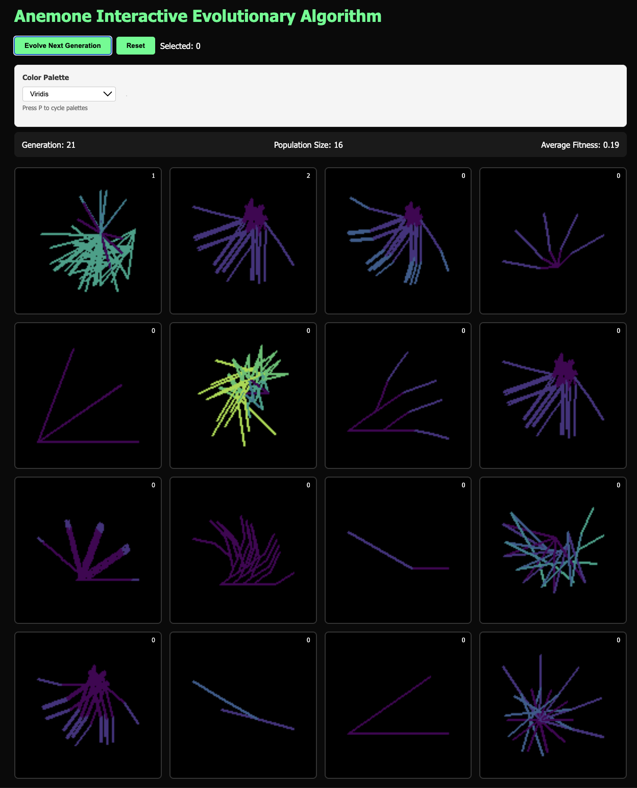

# Anemone 

Anemone is a library for interactive evolutionary computation (interactive EC or IEC), and a set of plug-in demos for the library.

# Interactive EC 

Evolutionary computation means algorithms inspired by Darwinian evolution, like genetic algorithms and genetic programming (not the same thing). 

# What do I do?

You should see a grid of images. Click the ones you like, then click "Evolve", and repeat endlessly.

You can also change the palette (drop-down menu), or try a different "domain" for evolution (a different drop-down). Best ones: Creature, Superformula3D, GPPattern, Character.

# MIDI?

It might ask you to enable MIDI. That's for music. You can say no if you just want to try the graphical settings.

# Is this AI Art?

Yes, but there is no training corpus. 

# Creation

This was designed and partly implemented by me (jmmcd) but mostly implemented by Claude Code. 

