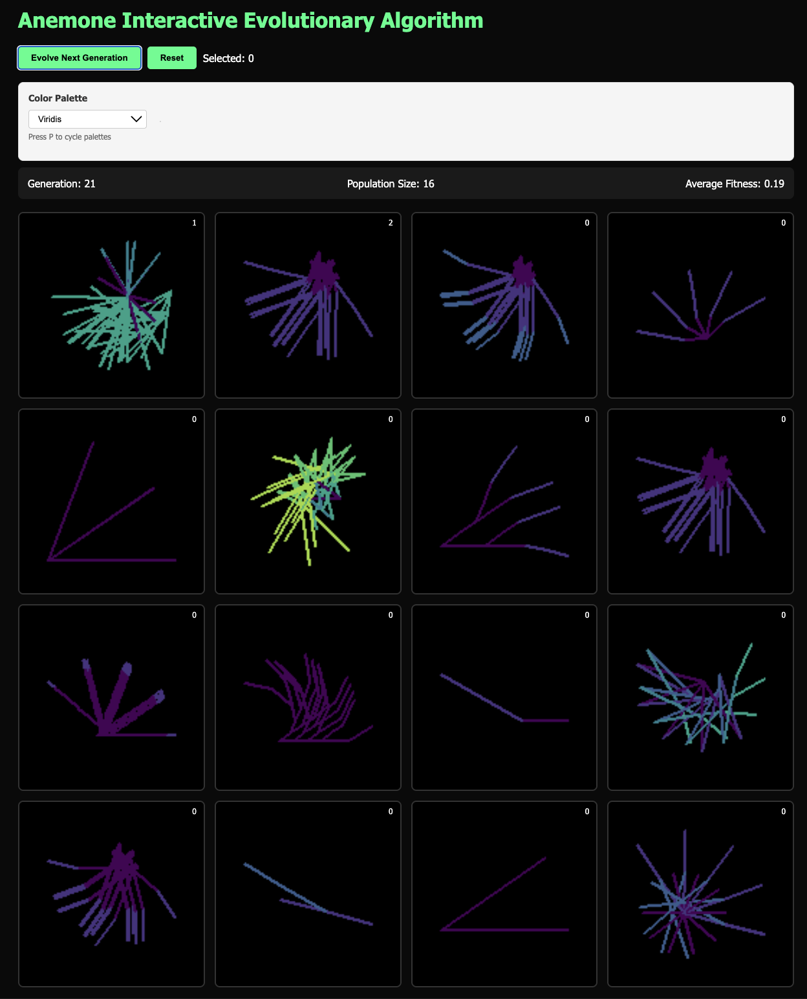

# Anemone 

Anemone is a library for interactive evolutionary computation (interactive EC or IEC), and a set of plug-in demos for the library.

You can download this repo and double-click the html file, or you can [visit a hosted version at surge.sh](https://anemone.surge.sh/) (thanks!).



# Interactive EC 

Evolutionary computation means algorithms inspired by Darwinian evolution, like genetic algorithms and genetic programming (not the same thing). 

# What do I do?

You should see a grid of images. Click the ones you like, then click "Evolve", and repeat endlessly.

If you select zero, it throws them all away to make totally new ones. If you select one, it makes new ones by mutating that good one. If you select two or more, it uses crossover to make children and mutation as well.

You can also change the palette (drop-down menu), or try a different "domain" for evolution (a different drop-down). Best ones: Anemone, SuperShape3D, Pattern, Robot.

# MIDI?

It might ask you to enable MIDI. That's for music. You can say no if you just want to try the graphical settings.

# Is this AI Art?

Yes, but the good kind. There is no training corpus. 

# Architecture (for developers)

The system separates three concerns:

- **Representations** (`representations/`) — genome structure and genetic operators (`TreeRepresentation`, `FloatRepresentation`, `DAGRepresentation`, etc.)
- **Modalities** (`modalities/`) — output mechanisms (`Canvas2DModality`, `MIDIModality` with Web Audio fallback, `ThreeDModality`)
- **Individuals** (root `*.js`) — application code that composes a representation and a modality

Each individual holds a representation object and delegates `mutate`, `crossover`, and `clone` to it. Rendering is either done inline or via a modality helper. See `CLAUDE.md` for the full architecture reference.

# Deployment

I deploy this to Surge just by running this in the current directory:

```surge . anemone.surge.sh``` 


# Creation

This was designed and partly implemented by me (jmmcd) but mostly implemented by Claude Code. 

