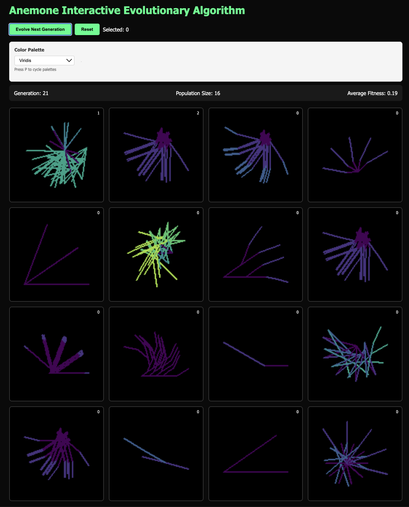

# Anemone 

Anemone is a library for interactive evolutionary computation (interactive EC or IEC), and a set of plug-in demos for the library.

You can download this repo and double-click the html file, or you can visit http://jmmcd.net/Anemone.

# Interactive EC 

Evolutionary computation means algorithms inspired by Darwinian evolution, like genetic algorithms and genetic programming (not the same thing). 

Interactive means instead of a *fitness function*, fitness is determined by the user's preferences - a bit like a farmer breeding sheep.

# What do I do?

You should see a grid of images. Click the ones you like, then click "Evolve", and repeat endlessly.

If you select zero, then "Evolve" throws them all away to make totally new ones. If you select one, it makes new ones by mutating that good one. If you select two or more, it uses crossover to make children and mutation as well.

You can also change the palette (drop-down menu), or try a different "domain" for evolution (a different drop-down). Some of the best ones: Anemone, SuperShape3D, Pattern, Robot, Drum Machine, L-System, Cat.

# Evolving a movement

Most of the apps evolve a picture. "Cat (animated)" evolves a *movement*: the genome describes a little animal **and** the way it walks, and every tile is a live walk cycle rather than a still. There are no keyframes and no sprite sheets — the pose is worked out from a handful of oscillators every frame, which is precisely what lets it be bred like anything else here. Click the ones that move the way you like. `.` pauses them all, and `[` / `]` slow them down and speed them up. Double-click a cat to zoom in, then **click its legs** to cycle the gait (walk, trot, pace, bound) or **drag them left and right** to change how fast it walks — those edits go into the genome, so the cat passes its new walk on to its kittens. `examples/parametric-cat.html` is the same idea as a single self-contained p5.js sketch, with no evolution around it, if you want to see how it works.

# Program Trace Optimisation

The evolutionary algorithm in the background is [Program Trace Optimisation](https://github.com/Program-Trace-Optimisation/PTO). PTO is a highly general and easy-to-use evolutionary algorithm that -- uniquely -- defines a univeral representation, the **program trace**, suitable for all evolutionary algorithm problems. Instead of providing and encoding and search operators (initialisation, mutation, crossover), they just define a **generator function** which samples from the desired search space. In an interactive setting we don't need any fitness. 

# Adding new apps

Thanks to the PTO representation, it is extremely easy to add a new app. It just requires one new file which defines a generator function. 

# Palettes

You can change the palette, which affects the appearance of most apps, by pressing 'p' or using the side menu. We have a selection of palettes, many made using the OKLCH perceptual interpolation.

# Zoom in, saving, and loading

You can double-click an individual to zoom in on it. You'll then see a button for saving it, usually in `png` format, and/or `stl`, `wav`, or `midi` depending on the app. These formats includes the individual genotype and phenotype, saved as JSON in the metadata (PNG: metadata, WAV: `anmn` RIFF chunk, MIDI (saving Type 0 SMF): sequencer-specific meta event). The Load button in the side menu allows you to load in a previously-saved individual.

# Hotkeys

* `0`, `1`, ... `9`, `A`, `B`, ... `F` selects or de-selects an individual, and also activates it for music types.
* `space` clicks the Evolve button.
* `.` toggles play/pause and rotate/stop.
* `[` and `]` zoom in and out on the 3D individuals, 
* `=` and `-` change the focal length of the 3D individuals, and 
* `\` resets all of the above to default.
* `[` and `]` shorten or lengthen the music sequences.
* `[` and `]` slow down and speed up the animated apps (Cat), and `.` pauses them.
* `p` cycles the palette.

# MIDI?

It might ask you to enable MIDI in your browser. That's for connecting some of the musical apps to your sequencer, eg GarageBand or Reaper. You can say no if you just want to try the graphical apps.

# Is this AI Art?

Yes, but the good kind. There is no training corpus. 

# Creation

This was designed and partly implemented by me (jmmcd) but mostly implemented by Claude Code. 

